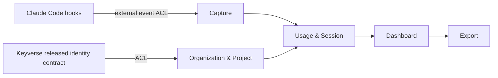

# Argos product·technical gap baseline

Status: Proposed  
Evidence baseline: protected `developmental@2fa92012bcf80acc1f921a4bafea76b3b1424b46`  
Last reconciled: 2026-09-11

이 문서는 구매자 관점의 제품 요구와 현재 코드·PR·운영 근거 사이의 차이를 추적한다. 구현되지 않은 기능을 완료된 것으로 적지 않으며, PR head가 움직이면 이전 head의 GREEN을 새 head의 증거로 재사용하지 않는다.

## Product truth and bounded contexts

`docs/prd.md`의 현재 제품 정의는 Claude Code hook 이벤트를 수집해 팀 단위 사용 패턴, 세션, 토큰 사용량, Skill/Agent 활용도를 분석하는 셀프호스팅 옵저버빌리티 제품이다. Core domain truth는 **AI usage observability**에 남긴다. Identity, CI/security foundation, 외부 provider 기능은 product domain에 source-copy하지 않는다.

현재 코드와 PRD를 기준으로 bounded context를 다음처럼 다룬다.

| Bounded context | 책임 | 주요 invariant | 경계 |
| --- | --- | --- | --- |
| Capture | Claude Code hook/event 수신 | hook 실패가 Claude Code 실행을 막지 않음 | 외부 hook payload를 ACL에서 검증 |
| Usage & Session | session/event/token/cost truth | 동일 event의 의미와 시간 순서를 보존 | Core domain |
| Organization & Project | org/project membership, scope | 다른 org 데이터 접근 금지 | Identity와 분리 |
| Dashboard | 조회·시각화·세션 탐색 | domain truth를 재정의하지 않음 | read model |
| Export | 사람이 여는 CSV 등 외부 표현 | untrusted cell이 spreadsheet 문법으로 재해석되지 않도록 방어 | presentation/egress boundary |
| Identity integration | login/signup/session identity | 제품 form은 Argos가 소유하되 identity backend truth는 Keyverse released contract를 사용 | external ACL |

Aggregate transaction은 필요한 최소 범위로 제한한다. Organization/Project membership 변경과 Event/Session ingest를 하나의 대형 transaction으로 묶지 않는다. 다른 CWL 서비스의 DB를 직접 조회하거나 mutable sibling PR head를 runtime dependency로 사용하지 않는다.

## Gap ledger

### G-001 — CSV/spreadsheet export boundary

**Problem.** Session export에는 사용자 제어 문자열이 포함된다. Spreadsheet는 일부 leading cell value를 수식으로 해석할 수 있다. OWASP WSTG-INJT-21은 실제 위험이 CSV를 spreadsheet application에서 열 때 나타나며 client configuration과 user interaction에 따라 영향이 달라질 수 있음을 명시한다. OWASP ASVS 5.0.0 `v5.0.0-1.2.10`은 RFC 4180의 CSV escaping과 함께 field 첫 문자의 `=`, `+`, `-`, `@`, tab, NUL에 대한 single-quote escaping을 요구한다.

**Current evidence.** PR #614 current exact head `48bfeeddea2f7f1a72ea378457a5661c111e3862`는 protected base 대비 route, `csv-helper.ts`, focused regression 세 파일만 변경한다. Intervening `5158b587...`가 dependency/lockfile과 helper script를 leaf PR에 섞고 CSV regression을 제거했지만 ordinary child `9231eeb0...`에서 reviewed three-file tree를 복원했다. Hosted CI `34608030315`는 `\v`/`\f` 자체를 formula trigger로 취급한 잘못된 fixture를 RED로 만들었고, `12ef7f4f...`는 test만 `\v=cmd|`, `\f@cmd|`로 교정했다.

Fresh standards traceability에서 ASVS 5.0.0의 NUL requirement가 현재 helper에 빠져 있음을 확인했다. Test-only head `c364326de8b0d5a9477c2e1eb63b11550b3a557e`의 hosted CI `34608759593`은 정확히 NUL case 하나에서 expected `"'\u0000cmd|"` / received `"\u0000cmd|"`로 실패했고 나머지 web tests 294개는 통과했다. Current candidate `48bfeed...`는 direct formula-prefix class에 NUL만 추가한다. SAST `34608974221`은 GREEN이며 current CI/CodeQL generation은 같은 exact head에서 재검증 중이다. Security failure는 #615가 소유하는 protected-base dependency findings다.

**Remaining RED.** #615가 immutable protected ancestry에 병합되기 전 leaf Security는 GREEN이 될 수 없다. 또한 Microsoft Excel/LibreOffice Calc에서 benign formula-like fixture가 formula로 평가되지 않는지, locale separator가 달라도 단일 cell로 보존되는지, save/re-open 후에도 mitigation이 유지되는지 실제 evidence가 없다.

**GREEN acceptance.** #615 정상 병합 뒤 #614를 non-force restack하고 exact-head CI/SAST/Security/CodeQL/current review를 다시 통과한다. 그 후 isolated/right-cleared fixture를 사용해 Excel과 LibreOffice에서 open → inspect → save/re-open을 검증하고 application/version/locale, raw CSV, rendered cell/formula-bar 결과를 남긴다. 실패 시 export contract를 조정하되 downstream machine-import semantics를 무근거로 바꾸지 않는다.

### G-002 — Dependency security foundation ownership

**Problem.** protected base에는 Next.js, sharp, browserslist, deepmerge-ts, baseline-browser-mapping 관련 scanner findings가 남아 있다. Leaf feature PR에 lockfile을 복사하면 owner와 provenance가 흐려진다.

**Current evidence.** PR #615 current exact head `23bd6289a2ab216fdd781e41da622c609f571c12`는 protected base 대비 effective diff가 `package.json`, `pnpm-lock.yaml` 두 파일이다. `next 15.5.25`, `sharp 0.35.4`, `browserslist 4.28.9`, `deepmerge-ts 8.0.2`, `baseline-browser-mapping 2.11.22`로 기존 Next 15.x product line을 보존하면서 scanner findings를 제거한다. Earlier valid tree `ecee9aed...`에서 CI `34608558343`, Security `34608558398`, SAST `34608558367`은 GREEN이었다. CodeQL `34608558368`은 javascript-typescript consumer가 14:13:12Z에 먼저 실패한 뒤 authoritative dispatch가 14:13:55Z에 시작해 14:14:04Z 성공하는 중앙 producer/consumer ordering defect를 재현했다.

Live branch는 이후 zero-file-delta descendant `23bd6289...`로 전진했다. Tree는 `ecee9aed...`와 동일하지만 exact SHA가 달라졌으므로 predecessor GREEN을 current-head evidence로 재사용하지 않는다. Current exact head에서는 CI `34609082611`, Security `34609082590`, SAST `34609082490`이 GREEN이고 CodeQL `34609082561`은 current generation에서 재검증 중이다.

**GREEN acceptance.** current package/lock diff의 qualifying independent review와 중앙 CodeQL exact authenticated receipt/settlement가 같은 unchanged head에 필요하다. 정상 merge된 immutable protected ancestry 이후 #612/#614/#616을 non-force restack하고 fresh exact-head 검증을 수행한다.

### G-003 — Timeline performance evidence and scope repair

**Problem.** Session timeline의 timestamp parse 중복은 계산량을 늘리지만, 계산 중복 감소와 buyer-visible p95 개선은 같은 주장이 아니다. 성능 PR에 unrelated repository snapshot이나 security repair가 섞이면 원인·검증 경계도 무너진다.

**Current evidence.** PR #612 current exact head `1e97fca0e4c55222d88d3d062a60d5a487f5bd1f`는 protected base 대비 timeline source와 focused regression 두 파일만 변경한다. Intervening unrelated snapshot/security delta를 ordinary descendant에서 반환했고, empty usage + TOOL messages에서 hook order를 유지하면서 불필요한 timestamp parse/sort를 하지 않도록 `hasUsage` guard를 useMemo 내부에 둔다. Mixed-order regression은 usage row마다 timestamp를 한 번 parse하는 계약을 유지한다.

**Remaining RED.** #615 merge 후 fresh exact-head correctness/security/CodeQL/independent-review generation과 representative buyer workload 성능 evidence가 필요하다.

**GREEN acceptance.** representative/right-cleared timeline workload로 browser main-thread time, CPU, allocation/GC, median·p95를 측정한다. sample 축소나 비현실적 warm cache로 목표를 맞추지 않고 정확성 regression과 함께 제시한다.

### G-004 — Material UI accessibility evidence

**Problem.** decorative chevron을 accessibility tree에서 숨기는 source change만으로 실제 assistive-technology UX가 완료됐다고 볼 수 없다.

**Current evidence.** PR #616 exact head `56742ebac9de46158418e20951b7829bfc988f78`은 `ContextSection` chevron을 `aria-hidden` 처리하고 기존 accessible name/`aria-expanded` contract를 보존한다.

**GREEN acceptance.** #615 merge/restack 이후 current-head browser에서 collapsed/expanded button의 accessibility tree, Tab/Enter/Space 동작, focus visibility를 검증한다. 정상/loading/empty/error/permission 및 주요 responsive width에 영향을 주는 UI 변경이 생기면 같은 generation에서 E2E와 screenshot evidence를 추가한다.

### G-005 — Identity architecture drift

**Problem.** `docs/prd.md`는 Argos 자체 email/password + JWT + bcrypt를 현재 인증 방식으로 정의한다. CWL architecture에서 제품은 login/signup/recovery form을 소유하지만 identity backend truth는 Keyverse의 released contract가 소유한다.

**Risk.** 자체 identity truth를 계속 확장하면 credential lifecycle, recovery, revocation, audit semantics가 제품별로 분기된다.

**GREEN acceptance.** 먼저 Keyverse의 released/versioned API/client/schema를 inventory한다. Argos Ubiquitous Language의 Organization/Project membership은 Argos에 남기고 credential/identity truth만 ACL을 통해 위임한다. mutable sibling head, source copy, cross-service SQL은 금지한다. contract가 부족하면 Argos workaround보다 Keyverse owner path의 RED/GREEN/release를 먼저 수리한다.

### G-006 — Data retention, PII purpose boundary, auditability

**Problem.** PRD는 MVP에서 event data를 무기한 보존하고 retention/deletion을 비스코프로 둔다. Session transcript와 사용자 식별·사용 패턴은 운영·감사 목적을 넘어 장기 보존될 위험이 있다.

**GREEN acceptance.** data class별 purpose, legal/business retention basis, deletion/anonymization rule, export/audit evidence를 정의한다. destructive retention job을 바로 추가하기 전에 실제 schema/foreign-key/cardinality와 복구·감사 요구를 TRD/ADR로 연결한다. CSAP/SOC 2 evidence에 필요한 access/audit trail과 data minimization을 함께 검증한다.

### G-007 — Performance SLO traceability

**Problem.** 현재 PRD는 dashboard API p99 ≤ 1,000 ms를 정의하지만 buyer-facing critical path의 p95 ≤ 20 ms 검증과 query/I/O/render profile은 연결되어 있지 않다.

**GREEN acceptance.** 실제 buyer path를 먼저 식별하고 async+k6/E2E로 cold/warm 조건을 구분해 p50/p95/p99를 측정한다. p95가 20 ms를 넘으면 query plan, I/O, render/hydration/main-thread, runtime/language 비용을 profile한 뒤 causal hot path만 최적화한다. 정확성·authorization contract를 희생하거나 sample을 줄여 수치를 맞추지 않는다.

### G-008 — Product documentation and release evidence

**Problem.** PRD는 2026-04-14 Draft이며 현재 open PR·foundation architecture와 차이가 있다. release-ready 여부를 version/CHANGELOG/tag/package/SBOM/provenance/reproducibility/rollback 하나의 exact protected generation에 연결한 canonical evidence도 아직 없다.

**GREEN acceptance.** PRD/TRD/architecture/ADR를 merged code와 함께 갱신하고 release candidate exact SHA에서 build/API/schema/E2E/security/SBOM/provenance/rollback evidence를 묶는다. 문서가 구현보다 앞서 Accepted 상태가 되지 않도록 한다.

### G-009 — CI/runtime operability warnings

**Problem.** Fresh #614 CI log에서 workflow action runtime이 Node 20 deprecation 경고를 내고, `pnpm/action-setup` 경로에서 Node `url.parse()` deprecation이 보인다. PostgreSQL service health probe도 `pg_isready`를 DB user 없이 실행해 반복적으로 `role "root" does not exist`를 로그에 남긴다. 테스트 자체가 동작하더라도 이런 소음은 실제 장애 신호를 가리고 장기적으로 hosted-runner/runtime 전환 실패가 될 수 있다.

**Owner boundary.** Reusable CI/action-runtime policy가 중앙 `.github` 책임이면 Argos leaf workflow에서 독자 dialect를 만들지 않고 canonical owner에 exact log/RCA/acceptance를 전달한다. Argos가 직접 소유하는 thin caller/service configuration만 causal local fix 대상이다.

**GREEN acceptance.** active workflow owner를 먼저 확인한 뒤, Node runtime deprecation은 maintained action/runtime generation으로 전환하고 deprecated API warning의 실제 emitting owner를 추적한다. PostgreSQL health probe는 명시적 Argos DB user/database로 검사해 정상 readiness가 error log를 생성하지 않게 한다. Warning suppression이나 `ACTIONS_ALLOW_USE_UNSECURE_NODE_VERSION` 같은 우회는 acceptance가 아니다.

## Decision rules

1. Core event/session/usage semantics와 Organization/Project Ubiquitous Language는 Argos가 소유한다.
2. Identity truth는 Keyverse released contract를 ACL로 소비한다. foundation을 전제품 강제 설치물로 만들지 않는다.
3. Dependency remediation은 #615 같은 canonical owner lane에서 처리하고 feature PR의 lockfile로 우회하지 않는다.
4. Security/performance/a11y 주장은 exact-head evidence의 범위를 넘겨 일반화하지 않는다.
5. PR head가 움직이면 이전 generation의 GREEN/approval을 자동 승계하지 않는다. Tree가 같더라도 exact SHA evidence는 구분한다.
6. Release는 protected exact head에서 immutable artifact와 rollback evidence가 동시에 있을 때만 수행한다.

## Traceability

| Evidence | Role |
| --- | --- |
| `docs/prd.md` | 제품 정의, 현재 기능·SLO·MVP 비스코프 |
| protected `developmental@2fa92012bcf80acc1f921a4bafea76b3b1424b46` | 현재 canonical code baseline |
| PR #614 / `48bfeeddea2f7f1a72ea378457a5661c111e3862` | CSV export boundary, leading-control fixture correction, ASVS NUL RED→repair |
| PR #615 / `23bd6289a2ab216fdd781e41da622c609f571c12` | dependency security foundation; CI/Security/SAST current-head GREEN |
| PR #612 / `1e97fca0e4c55222d88d3d062a60d5a487f5bd1f` | timeline parse-once + empty-state zero-work repair |
| PR #616 / `56742ebac9de46158418e20951b7829bfc988f78` | ContextSection accessibility delta |
| CI `34608759593` | ASVS NUL-prefix realistic RED: one targeted failure, 294 other web tests passed |
| CodeQL `34608558368` | central producer/consumer settlement ordering canary from #615 predecessor exact head |

## References

OWASP Foundation. (2025). *OWASP Application Security Verification Standard 5.0.0* (Requirement v5.0.0-1.2.10, CSV and Formula Injection). https://github.com/OWASP/ASVS/tree/v5.0.0

OWASP Foundation. (n.d.). *CSV injection*. Retrieved September 11, 2026, from https://owasp.org/www-community/attacks/CSV_Injection

OWASP Foundation. (n.d.). *Testing for CSV injection (WSTG-INJT-21)*. In *OWASP Web Security Testing Guide: Latest*. Retrieved September 11, 2026, from https://wstg.owasp.org/latest/4-Web_Application_Security_Testing/07-Injection/21-CSV_Injection/

MITRE. (2026). *CWE-1236: Improper neutralization of formula elements in a CSV file*. CWE 4.20. https://cwe.mitre.org/data/definitions/1236.html

Shafranovich, Y. (2005). *Common format and MIME type for comma-separated values (CSV) files* (RFC 4180). Internet Engineering Task Force. https://www.rfc-editor.org/rfc/rfc4180
