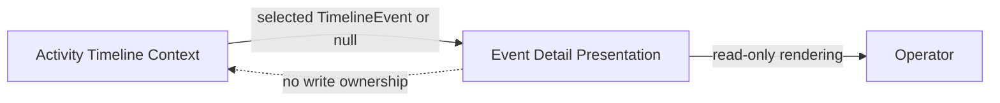
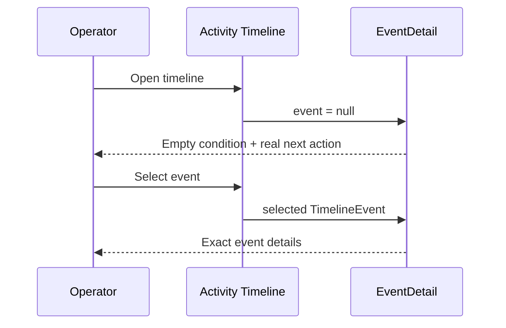

# Product–Technical Gap Baseline

Status: **Proposed**
Last evidence refresh: 2026-09-20
Current baseline writer: [argos#651](https://github.com/ContextualWisdomLab/argos/pull/651)
Tracked reusable-control review: [argos#656](https://github.com/ContextualWisdomLab/argos/pull/656)
Evidence ancestor: `db97dec458813daa200a314bb809e95f02343b3c`

## Goal and loop

Argos must present timeline truth without inventing or replacing domain state. The review loop is: inspect the current PR head, repair the canonical writer with a regression test, run exact-head checks, obtain independent review and real-browser evidence, then merge ordinarily. A blocked or Proposed change remains open and Draft.

## PRD

When no timeline event is selected, the event-detail panel must:

- state the empty condition explicitly;
- tell the user the real next action without presenting a dead control;
- expose the message to assistive technology while hiding the decorative icon;
- preserve product-owned typography, color, and spacing tokens.

When an event is selected, `TimelineEvent` remains the domain truth. The empty-state presentation must not manufacture an event or persist presentation DTO state.

## TRD

The product-owned `EventDetail` component renders the null branch. The null branch uses existing Tailwind design tokens and a decorative Lucide icon. A colocated Vitest/React Testing Library contract fixes the exact title hierarchy, next-action sentence, and `aria-hidden` icon boundary.

Figma component ID: **none evidenced**. Storybook story: **none evidenced**. Neither is claimed complete by this baseline.

## Context Map

- Upstream domain owner: Activity Timeline Context.
- Downstream presentation owner: Event Detail Presentation.
- Integration contract: `TimelineEvent | null`.
- Anti-corruption boundary: presentation text and icons do not become timeline domain facts.

## UML

## ERD

No database entity or relationship is added or changed by argos#651. The surface is read-only presentation over the released timeline contract; package and lockfile changes in the same PR are preserved as a separate dependency delta and are not evidence of UI acceptance.

## Exact-head acceptance matrix

| Concern | Evidence | Status |
|---|---|---|
| Deterministic copy and hierarchy | `event-detail.test.tsx` asserts the exact title class and sentence | Source PASS; hosted check pending |
| Semantics | Null branch contains no synthetic event or dead CTA | Source PASS |
| Accessibility | Empty-state SVG plus #656 reusable Chevron icons are `aria-hidden`; ContextSection/Pagination contracts preserve parent names and behavior; browser/AT reading order and contrast not captured | Partial |
| Responsive layout | 320 px, 768 px, and desktop screenshots absent | FAIL |
| Pointer, touch, keyboard | Empty state has no interactive control; timeline selection path still needs real-browser replay | Pending |
| Loading/error/offline/permission/read-only/stale/conflict/retry/busy | Not introduced by the null branch; surrounding timeline states are not evidenced here | Pending |
| Locales | ko/en/ja/zh/vi/es/de/fr wrapping and fallback evidence absent | FAIL |
| Large-data performance | Timeline-to-detail selection median and p95 absent | FAIL |
| Import/export and recovery | No data mutation in this branch; reload and selection recovery replay absent | Pending |
| Dependency delta | `package.json` and `pnpm-lock.yaml` changes share this PR without UI acceptance linkage | Blocked |

## Gap and action ledger

| Gap | Required action | Status |
|---|---|---|
| Empty-state review findings | Keep RED contract, repair title weight and exact sentence, resolve only after exact-head verification | Repaired; checks pending |
| Reusable Chevron semantics (#656) | Preserve parent labels, expanded state, page change, Select scrolling, Week navigation and virtualized group disclosure while decorative SVGs remain hidden | Source repair + partial component tests; browser/AT pending |
| Real-browser evidence | Replay selection and null-state transitions in Chromium, Firefox, and WebKit at 320/768/desktop widths; capture screenshots and keyboard/AT results | Open |
| Eight-locale evidence | Exercise ko/en/ja/zh/vi/es/de/fr with CJK fallback, expansion, and wrapping | Open |
| Storybook states | Add product-owned normal/empty/loading/error/permission/read-only/offline/stale/conflict/retry/busy stories where applicable | Open |
| Dependency ownership | Reconcile the dependency delta with its canonical owner and validate build, security, SBOM, and provenance separately | Open |
| Performance | Measure realistic timeline selection/render median and p95 without reducing data volume | Open |

## Release decision

argos#651 remains **Draft/Proposed** until exact-head CI and security checks are terminal GREEN, current-head independent review exists, unresolved review threads are repaired, and applicable browser, accessibility, responsive, locale, recovery, and performance rows pass. No release or GitHub Pages publication is claimed.
