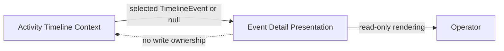
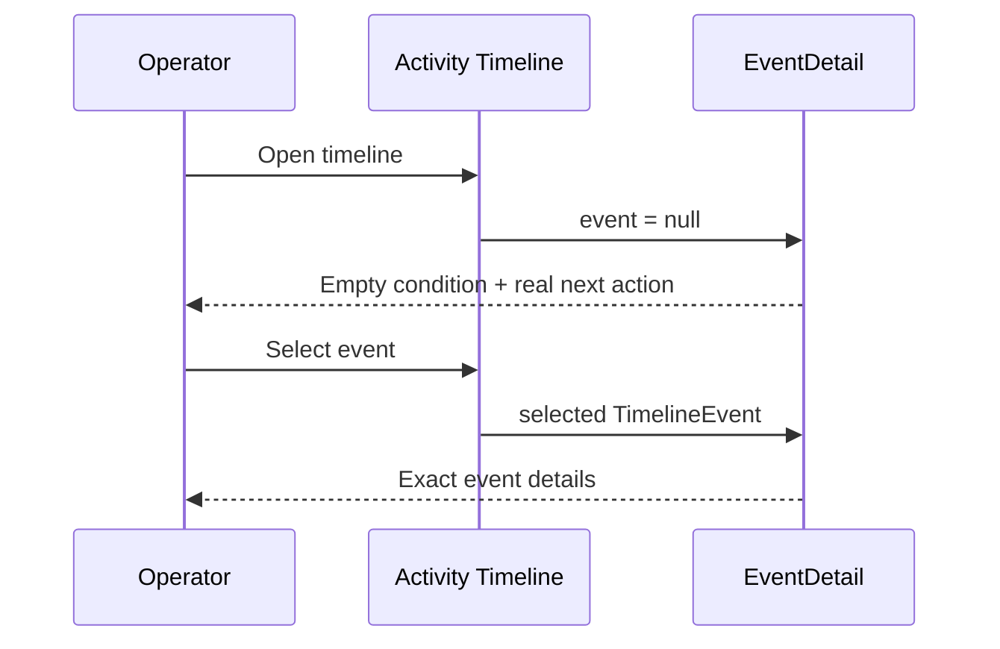
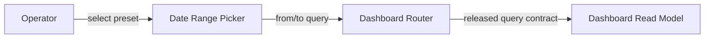

# Product–Technical Gap Baseline

Status: **Proposed**
Last evidence refresh: 2026-09-20
Current baseline writer: [argos#651](https://github.com/ContextualWisdomLab/argos/pull/651)
Tracked reusable-control review: [argos#656](https://github.com/ContextualWisdomLab/argos/pull/656)
Tracked reusable-control evidence: `656cb7e19684fe5e7b613c3c1799d433a82f541e`
Evidence ancestor: `db97dec458813daa200a314bb809e95f02343b3c`

## Goal and loop

Argos must present timeline truth without inventing or replacing domain state. The review loop is: inspect the current PR head, repair the canonical writer with a regression test, run exact-head checks, obtain independent review and real-browser evidence, then merge ordinarily. A blocked or Proposed change remains open and Draft.

## PRD

When no timeline event is selected, the event-detail panel must:

- state the empty condition explicitly;
- tell the user the real next action without presenting a dead control;
- expose the message to assistive technology while hiding the decorative icon;
- preserve product-owned typography, color, and spacing tokens.

When an event is selected, `TimelineEvent` remains the domain truth. The empty-state presentation must not manufacture an event or persist presentation DTO state.

## TRD

The product-owned `EventDetail` component renders the null branch. The null branch uses existing Tailwind design tokens and a decorative Lucide icon. A colocated Vitest/React Testing Library contract fixes the exact title hierarchy, next-action sentence, and `aria-hidden` icon boundary.

Figma component ID: **none evidenced**. Storybook story: **none evidenced**. Neither is claimed complete by this baseline.

## Context Map

- Upstream domain owner: Activity Timeline Context.
- Downstream presentation owner: Event Detail Presentation.
- Integration contract: `TimelineEvent | null`.
- Anti-corruption boundary: presentation text and icons do not become timeline domain facts.

## UML

## ERD

No database entity or relationship is added or changed by argos#651. The surface is read-only presentation over the released timeline contract; package and lockfile changes in the same PR are preserved as a separate dependency delta and are not evidence of UI acceptance.

## Exact-head acceptance matrix

| Concern | Evidence | Status |
|---|---|---|
| Deterministic copy and hierarchy | `event-detail.test.tsx` asserts the exact title class and sentence | Source PASS; hosted check pending |
| Semantics | Null branch contains no synthetic event or dead CTA | Source PASS |
| Accessibility | Empty-state SVG plus #656 reusable Chevron icons are `aria-hidden`; ContextSection, Pagination, WeekNavigator, EventList, and Select trigger contracts preserve parent names and behavior; Select scroll and browser/AT evidence remain open | Partial |
| Responsive layout | 320 px, 768 px, and desktop screenshots absent | FAIL |
| Pointer, touch, keyboard | Empty state has no interactive control; timeline selection path still needs real-browser replay | Pending |
| Loading/error/offline/permission/read-only/stale/conflict/retry/busy | Not introduced by the null branch; surrounding timeline states are not evidenced here | Pending |
| Locales | ko/en/ja/zh/vi/es/de/fr wrapping and fallback evidence absent | FAIL |
| Large-data performance | Timeline-to-detail selection median and p95 absent | FAIL |
| Import/export and recovery | No data mutation in this branch; reload and selection recovery replay absent | Pending |
| Dependency delta | `package.json` and `pnpm-lock.yaml` changes share this PR without UI acceptance linkage | Blocked |

## Gap and action ledger

| Gap | Required action | Status |
|---|---|---|
| Empty-state review findings | Keep RED contract, repair title weight and exact sentence, resolve only after exact-head verification | Repaired; checks pending |
| Reusable Chevron semantics (#656) | Preserve parent labels, expanded state, page change, Select scrolling, Week navigation and virtualized group disclosure while decorative SVGs remain hidden | Source repair + five focused component contracts; Select scroll and browser/AT pending |
| Real-browser evidence | Replay selection and null-state transitions in Chromium, Firefox, and WebKit at 320/768/desktop widths; capture screenshots and keyboard/AT results | Open |
| Eight-locale evidence | Exercise ko/en/ja/zh/vi/es/de/fr with CJK fallback, expansion, and wrapping | Open |
| Storybook states | Add product-owned normal/empty/loading/error/permission/read-only/offline/stale/conflict/retry/busy stories where applicable | Open |
| Dependency ownership | Reconcile the dependency delta with its canonical owner and validate build, security, SBOM, and provenance separately | Open |
| Performance | Measure realistic timeline selection/render median and p95 without reducing data volume | Open |

## Release decision

argos#651 remains **Draft/Proposed** until exact-head CI and security checks are terminal GREEN, current-head independent review exists, unresolved review threads are repaired, and applicable browser, accessibility, responsive, locale, recovery, and performance rows pass. No release or GitHub Pages publication is claimed.

## Date-range picker acceptance — argos#701

Product source is now the stable complete-carryover successor argos#701; this documentation lane records evidence only. Product evidence exact: `04d8afe8258112bd870c5f44e29430495d96284a`. The predecessor argos#694 remains open Draft at repeated-regression head `81696ffa29f3fc9722f2bf3779ee75aba428aa50`; it is not treated as completed until protected-`developmental` integration proves complete carryover.

### PRD / TRD

The operator must understand 7/30/90/all-time presets through an accessible name and must see the activated preset remain selected. The product-owned `DateRangePicker` computes inclusive calendar ranges, preserves unrelated query parameters, removes stale pagination, and exposes selection with `aria-pressed`. Presentation state never replaces the URL query contract.

### Context Map / UML / ERD

Sequence: select preset → compute inclusive `from`/`to` → delete `page` → push query → rerender matching `aria-pressed`. No database entity or relationship changes; this is a presentation/query-boundary repair.

### Exact-head acceptance matrix

| Concern | Exact evidence | Status |
|---|---|---|
| Determinism | Fixed local-calendar fixture expects 30-day URL `2026-08-28..2026-09-26` | Source PASS; hosted pending |
| Semantics | Default 7-day range and click path both use inclusive day count | Source PASS |
| Accessibility | Four buttons have exact accessible names and `aria-pressed` contracts | Source PASS; browser/AT pending |
| Query persistence | Existing parameters are copied; stale `page` is removed | Existing component contract; browser reload pending |
| Responsive / touch / keyboard | 320/768/desktop screenshots and real pointer/touch/keyboard replay absent | FAIL |
| Locales | ko/en/ja/zh/vi/es/de/fr names, wrapping, and fallback are not implemented/evidenced | FAIL |
| Loading/error/offline/stale/conflict/retry/busy | Suspense fallback exists; remaining states lack product evidence | Pending |
| Large-data performance | Dashboard refresh median/p95 and p95 ≤20 ms page target absent | FAIL |
| Import/export and recovery | Not a mutation surface; URL reload/back-forward recovery absent | Pending |
| Hosted validation | Stable successor argos#701 exact `04d8afe…` has CI, Security Scan, SAST Semgrep, and CodeQL PR runs queued after a meaningful RED→GREEN synchronize | FAIL until all exact-head runs are terminal GREEN |

### Gap / Action / status

- RED commits `cbedd54a…`, `29a693eb…`, and `17d25db…` fixed exact URL, default selection, and timezone-stable evidence before production.
- GREEN production `a923e14c…` aligns default and click calculations. After the fourth same-branch regression, stable successor argos#701 started from predecessor head `33078e37…` and restored the complete verified delta test-first at `566d631e…`, production at `fb672e71…`, and full CHANGELOG history at `3c4973f…`. Malformed URL dates are fixed by source-level RED `4facf856…`, fail-closed `parseISO`/`isValid` GREEN `d63dc2fe…`, and CHANGELOG evidence `04d8afe…`.
- argos#701 and predecessor argos#694 remain **Draft/Proposed** until exact-head hosted checks, current independent approval, real browser/AT, responsive, eight-locale, recovery, and performance evidence are complete.
- Preserve the meaningful synchronize evidence at argos#701@`04d8afe…`; do not use empty retrigger commits. `developmental` already includes the correct pull-request branch filter, so the prior zero-run condition was caused by base retarget alone not emitting a default workflow activity.

## 2026-09-27 decorative-control reconciliation

Canonical product writer #656 exact `656cb7e19684fe5e7b613c3c1799d433a82f541e` preserves the five reusable controls. Successor `7c0fa348…` deleted 226 lines of focused behavior tests, weakened two remaining contracts, and removed Palette/CHANGELOG evidence; seven ordinary-forward commits restored the verified blobs. Compared with verified `f99900b9…`, the current head is eight commits ahead with `files: []`.

| Surface | Exact evidence | Status |
|---|---|---|
| ContextSection, EventList, WeekNavigator, Pagination, SelectTrigger | Component contracts preserve accessible names, disclosure/navigation/page-change behavior, and decorative SVG boundaries | Source PASS; hosted/browser/AT pending |
| Duplicate writer #663 | Exact `44ad7d31…`; one source-neutral successor after `8e87e48…`, two valid icon additions plus broad formatting churn, no focused tests | Draft; preserve until protected carryover |
| Back control #664 | Exact `a0ea614d…`; two source-neutral successors after `6b154d3…`, same one hard-coded English label, no history-empty or eight-locale contract | Draft / FAIL |
| Checks and approval | #656 and both sibling heads have queued checks; no current independent approval | FAIL |
| Real interaction and locale | Pointer/touch/keyboard, AT, 320/768/desktop and ko/en/ja/zh/vi/es/de/fr absent | FAIL |

Do not close #663 or merge #664 on overlap alone. First prove protected integration or complete semantic/test carryover, then refresh this exact-head matrix.
