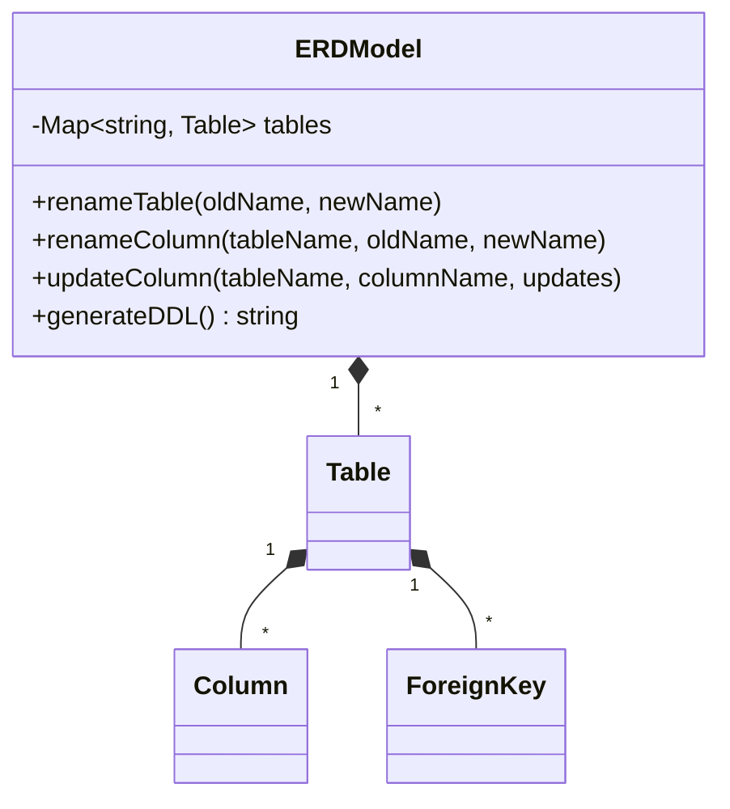
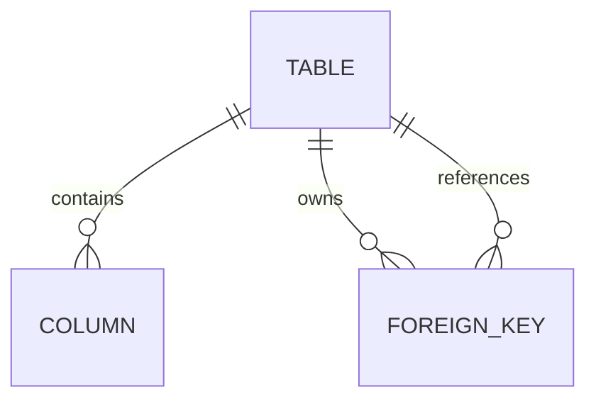

# Product–Technical Gap Baseline

Status: **Proposed**  
Owner: ContextualWisdomLab/argos  
Evidence: PR [#461](https://github.com/ContextualWisdomLab/argos/pull/461)

## Goal and loop

The product goal is to let a user evolve an ERD without corrupting table, column, or foreign-key truth. The loop is: validate a complete mutation request, apply it atomically to the `ERDModel` aggregate, generate deterministic PostgreSQL DDL, then verify persistence and recovery at the product boundary.

## PRD

A schema author can rename a table or column and update column properties. A failed request must leave the aggregate and generated DDL unchanged. A successful rename must preserve every local and incoming foreign-key reference.

## TRD

- `ERDModel` is the canonical in-memory writer for `Table`, `Column`, and `ForeignKey`.
- `getTable()` and `getTables()` return clones; callers cannot mutate aggregate state out of band.
- Identifier, SQL type, and default-value validation runs before any write.
- PostgreSQL DDL is a projection of aggregate truth, not an independent presentation DTO.

## UML

## ERD

A foreign key identifies exactly one local `columnName` and one referenced `referenceTable.referenceColumn`. Renames update those identifiers in the same aggregate operation.

## Context Map

`ERD UI/API (upstream)` → `ERDModel aggregate (canonical writer)` → `PostgreSQL DDL projection (downstream)`.

No Core foundation owns Argos schema truth. External persistence/import/export must consume a versioned Argos contract or an ACL; it must not write presentation state directly.

## Gap and action register

| ID | Gap | Evidence | Action | Status |
|---|---|---|---|---|
| G-ERD-001 | `updateColumn()` mutated `type` before validating a later default, so a rejected request changed domain truth. | RED `3b0741df5f675bd47d47c02ac2c4c8b8c93a774b`; local exact-source probe exited 1 with `integer → bigint`. | Validate every fallible field before assigning any field. Production repair `ffd1dd238cb77e0bd42b7cc9c3b6258e6c9abcfa`. | Candidate; local probe GREEN, hosted exact-head checks pending. |
| G-ERD-005 | An explicit `defaultValue: undefined` update could not remove an existing default, so generated DDL retained stale domain state. | RED `79350f7fe4cde081e9868db0ec8de790089e1bd1`; exact-source probe observed the property still present. | Distinguish an absent update key from an explicitly present `undefined` and delete the stored default. Production repair `9b447f08b4a782476c165f0375f435209506f0b4`. | Candidate; local exact-source probe GREEN, hosted checks pending. |
| G-ERD-002 | Import/export, persistence/reload, undo, and crash recovery are not exercised by this library-only PR. | PR diff changes only `erd.ts` and `erd.test.ts`. | Add product-boundary contract and real CTA→persistence→reload tests before claiming schema-evolution UX completion. | Proposed |
| G-ERD-003 | Large-schema rename/update latency and allocation are unmeasured. | No benchmark artifact in PR #461. | Record realistic table/column/FK denominator and median/p95 without shrinking samples. | Proposed |
| G-ERD-004 | WCAG 2.2 AA, pointer/touch/keyboard, reduced motion, responsive screenshots, and eight locales are not evidenced. | No UI file changes or browser artifact in PR #461. | Treat UI evidence as N/A for the library repair; require it on the consuming material UI PR. | Routed |

## Exact-head acceptance matrix

| Dimension | Evidence | Result |
|---|---|---|
| Determinism | Exact source probe compares the pre-error and post-error column snapshots. | PASS locally |
| Domain semantics | Failed compound update leaves the column unchanged after `ffd1dd238…`. | PASS locally |
| Hosted CI/security | Current PR-head CI, Security, Semgrep, and CodeQL PR generation; exact run IDs remain bound in the PR acceptance matrix. | PENDING |
| Accessibility/responsive/locales | No material UI delta in this PR. | N/A; consumer gate retained |
| Large-data performance | No realistic median/p95 artifact. | FAIL |
| Import/export and recovery | No persistence/reload/undo/crash contract. | FAIL |

An applicable FAIL or non-terminal check is not merge-ready.
