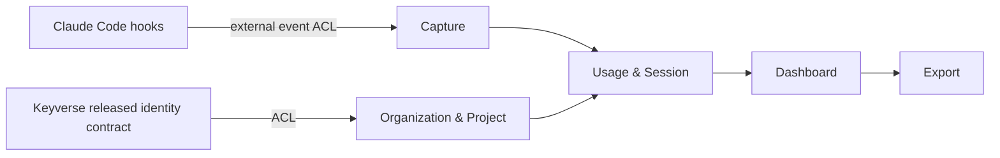

# Argos product·technical gap baseline

Status: Proposed  
Evidence baseline: protected `developmental@2fa92012bcf80acc1f921a4bafea76b3b1424b46`  
Last reconciled: 2026-09-11

이 문서는 구매자 관점의 제품 요구와 현재 코드·PR·운영 근거 사이의 차이를 추적한다. 구현되지 않은 기능을 완료된 것으로 적지 않으며, PR head가 움직이면 이전 head의 GREEN을 새 head의 증거로 재사용하지 않는다.

## Product truth and bounded contexts

`docs/prd.md`의 현재 제품 정의는 Claude Code hook 이벤트를 수집해 팀 단위 사용 패턴, 세션, 토큰 사용량, Skill/Agent 활용도를 분석하는 셀프호스팅 옵저버빌리티 제품이다. Core domain truth는 **AI usage observability**에 남긴다. Identity, CI/security foundation, 외부 provider 기능은 product domain에 source-copy하지 않는다.

현재 코드와 PRD를 기준으로 bounded context를 다음처럼 다룬다.

| Bounded context | 책임 | 주요 invariant | 경계 |
| --- | --- | --- | --- |
| Capture | Claude Code hook/event 수신 | hook 실패가 Claude Code 실행을 막지 않음 | 외부 hook payload를 ACL에서 검증 |
| Usage & Session | session/event/token/cost truth | 동일 event의 의미와 시간 순서를 보존 | Core domain |
| Organization & Project | org/project membership, scope | 다른 org 데이터 접근 금지 | Identity와 분리 |
| Dashboard | 조회·시각화·세션 탐색 | domain truth를 재정의하지 않음 | read model |
| Export | 사람이 여는 CSV 등 외부 표현 | untrusted cell이 spreadsheet 문법으로 재해석되지 않도록 방어 | presentation/egress boundary |
| Identity integration | login/signup/session identity | 제품 form은 Argos가 소유하되 identity backend truth는 Keyverse released contract를 사용 | external ACL |

Aggregate transaction은 필요한 최소 범위로 제한한다. Organization/Project membership 변경과 Event/Session ingest를 하나의 대형 transaction으로 묶지 않는다. 다른 CWL 서비스의 DB를 직접 조회하거나 mutable sibling PR head를 runtime dependency로 사용하지 않는다.

## Gap ledger

### G-001 — CSV/spreadsheet export boundary

**Problem.** Session export에는 사용자 제어 문자열이 포함된다. Spreadsheet는 `=`, `+`, `-`, `@`, tab/CR/LF 및 일부 full-width variant로 시작하는 cell을 수식으로 해석할 수 있고, separator/quote 조작으로 위험 prefix가 새 cell 첫 위치에 오게 만들 수도 있다. OWASP는 모든 환경에 보편적으로 안전한 단일 CSV sanitization이 없으며 실제 Excel/LibreOffice workflow 검증이 필요하다고 명시한다.

**Current evidence.** PR #614 current exact head `ca9734921b5b2db82cdf50f9f7b071751f6506ee`는 protected base 대비 route, `csv-helper.ts`, focused regression 세 파일만 변경한다. #615가 소유하는 package/lockfile re-entry를 ordinary-forward로 제거한 뒤, current-head review가 발견한 vertical-tab/form-feed leading-control omission을 test-first `ed110cf3...` → production `ca973492...`로 수리했다. `\v`/`\f` 자체를 formula trigger라고 일반화하지 않고, 실제 formula prefix 앞의 ASCII whitespace/control 방어 범위를 일관되게 만든다.

**Remaining RED.** 새 exact-head CI/SAST/Security/CodeQL과 independent review가 다시 terminalize되어야 한다. 또한 실제 Microsoft Excel과 LibreOffice Calc에서 benign formula-like fixture가 formula로 평가되지 않는지, locale separator가 달라도 단일 cell로 보존되는지, Excel save/re-open 뒤에도 mitigation이 유지되는지 current-head evidence가 없다.

**GREEN acceptance.** exact-head correctness/security gates를 먼저 통과한 뒤 isolated/right-cleared fixture를 사용해 Excel과 LibreOffice에서 open → inspect → save/re-open을 검증하고 application/version/locale, raw CSV, rendered cell/formula-bar 결과를 남긴다. 실패 시 export contract를 조정하되 downstream machine-import semantics를 깨는 tab prefix 등을 무근거로 강제하지 않는다.

### G-002 — Dependency security foundation ownership

**Problem.** protected base에는 Next.js, sharp, browserslist, deepmerge-ts, baseline-browser-mapping 관련 scanner findings가 남아 있다. Leaf feature PR에 lockfile을 복사하면 owner와 provenance가 흐려진다.

**Current evidence.** PR #615 current exact head `b8665e85ae9875acc90a782349bacb023a9450b7`는 protected base보다 9 commits ahead이며 effective diff는 `package.json`, `pnpm-lock.yaml` 두 파일이다. #614에서 발견된 dependency re-entry는 #615 owner lane으로 반환했다. Exact-head CI, Security Scan, SAST는 GREEN이다. CodeQL만 중앙 producer/consumer settlement ordering defect 때문에 실패하며 authoritative dispatch가 compatibility consumers보다 늦게 시작했다.

**GREEN acceptance.** current package/lock diff에 대한 독립 review와 중앙 CodeQL terminal acceptance가 같은 unchanged head에 필요하다. 정상 merge된 immutable protected ancestry 이후 dependent PR을 non-force restack한다.

### G-003 — Timeline performance evidence and scope repair

**Problem.** Session timeline의 timestamp parse 중복은 계산량을 늘리지만, 계산 중복 감소와 buyer-visible p95 개선은 같은 주장이 아니다. 성능 PR에 unrelated repository snapshot이나 security repair가 섞이면 원인·검증 경계도 무너진다.

**Current evidence.** PR #612는 intervening `ce838414...`와 `1f4eb793...`를 실제로 분류하고 ordinary descendant `ff458c39...`에서 unrelated 90-file snapshot/security delta를 반환했다. Current-head review는 empty usage + TOOL messages에서 hook order를 유지하려고 옮긴 preparation이 불필요한 timestamp parse/sort를 수행한다는 P2 finding을 냈다. 이를 conditional hook으로 되돌리지 않고 test-first `508bddbd...` → production `1e97fca0e4c55222d88d3d062a60d5a487f5bd1f`로 수리했다. `hasUsage` guard는 hooks를 항상 같은 순서로 호출하면서 empty chart의 tool normalization과 chart-data build를 건너뛴다. Protected-base effective diff는 여전히 timeline source와 focused regression 두 파일뿐이다.

**Remaining RED.** 새 exact head의 hosted CI/security/CodeQL/independent-review generation과 representative buyer workload performance evidence가 아직 완료되지 않았다.

**GREEN acceptance.** exact-head correctness checks를 먼저 통과한 뒤 representative/right-cleared timeline workload로 main-thread CPU, allocation/GC, median·p95를 재고 정확성 regression과 함께 제시한다. sample 축소나 비현실적인 warm cache로 목표를 맞추지 않는다.

### G-004 — Material UI accessibility evidence

**Problem.** decorative chevron을 accessibility tree에서 숨기는 source change만으로 실제 assistive-technology UX가 완료됐다고 볼 수 없다.

**Current evidence.** PR #616 exact head `56742ebac9de46158418e20951b7829bfc988f78`은 `ContextSection` chevron을 `aria-hidden` 처리하고 기존 accessible name/`aria-expanded` contract를 보존한다.

**GREEN acceptance.** current-head browser에서 collapsed/expanded accessibility tree, Tab/Enter/Space 동작, focus visibility를 검증한다. 정상/loading/empty/error/permission 및 주요 responsive width에 영향을 주는 UI 변경이 생기면 같은 generation에서 E2E와 screenshot evidence를 추가한다.

### G-005 — Identity architecture drift

**Problem.** `docs/prd.md`는 Argos 자체 email/password + JWT + bcrypt를 현재 인증 방식으로 정의한다. CWL architecture에서 제품은 login/signup/recovery form을 소유하지만 identity backend truth는 Keyverse의 released contract가 소유한다.

**Risk.** 자체 identity truth를 계속 확장하면 credential lifecycle, recovery, revocation, audit semantics가 제품별로 분기된다.

**GREEN acceptance.** 먼저 Keyverse의 released/versioned API/client/schema를 inventory한다. Argos Ubiquitous Language의 Organization/Project membership은 Argos에 남기고, credential/identity truth만 ACL을 통해 위임한다. mutable sibling head, source copy, cross-service SQL은 금지한다. contract가 부족하면 Argos workaround보다 Keyverse owner path의 RED/GREEN/release를 먼저 수리한다.

### G-006 — Data retention, PII purpose boundary, auditability

**Problem.** PRD는 MVP에서 event data를 무기한 보존하고 retention/deletion을 비스코프로 둔다. Session transcript와 사용자 식별·사용 패턴은 운영·감사 목적을 넘어 장기 보존될 위험이 있다.

**GREEN acceptance.** data class별 purpose, legal/business retention basis, deletion/anonymization rule, export/audit evidence를 정의한다. destructive retention job을 바로 추가하기 전에 실제 schema/foreign-key/cardinality와 복구·감사 요구를 TRD/ADR로 연결한다. CSAP/SOC 2 evidence에 필요한 access/audit trail과 data minimization을 함께 검증한다.

### G-007 — Performance SLO traceability

**Problem.** 현재 PRD는 dashboard API p99 ≤ 1,000 ms를 정의하지만 buyer-facing critical path의 p95 ≤ 20 ms 검증과 query/I/O/render profile은 연결되어 있지 않다.

**GREEN acceptance.** 실제 buyer path를 먼저 식별하고 async+k6/E2E로 cold/warm 조건을 구분해 p50/p95/p99를 측정한다. p95가 20 ms를 넘으면 query plan, I/O, render/hydration/main-thread, runtime/language 비용을 profile한 뒤 causal hot path만 최적화한다. 정확성·authorization contract를 희생하거나 sample을 줄여 수치를 맞추지 않는다.

### G-008 — Product documentation and release evidence

**Problem.** PRD는 2026-04-14 Draft이며 현재 open PR·foundation architecture와 차이가 있다. release-ready 여부를 version/CHANGELOG/tag/package/SBOM/provenance/reproducibility/rollback 하나의 exact protected generation에 연결한 canonical evidence도 아직 없다.

**GREEN acceptance.** PRD/TRD/architecture/ADR를 merged code와 함께 갱신하고 release candidate exact SHA에서 build/API/schema/E2E/security/SBOM/provenance/rollback evidence를 묶는다. 문서가 구현보다 앞서 Accepted 상태가 되지 않도록 한다.

## Decision rules

1. Core event/session/usage semantics와 Organization/Project Ubiquitous Language는 Argos가 소유한다.
2. Identity truth는 Keyverse released contract를 ACL로 소비한다. foundation을 전제품 강제 설치물로 만들지 않는다.
3. Dependency remediation은 #615 같은 canonical owner lane에서 처리하고 feature PR의 lockfile로 우회하지 않는다.
4. Security/performance/a11y 주장은 exact-head evidence의 범위를 넘겨 일반화하지 않는다.
5. PR은 current head가 moved 되었으면 이전 generation의 GREEN/approval을 승계하지 않는다.
6. Release는 protected exact head에서 immutable artifact와 rollback evidence가 동시에 있을 때만 수행한다.

## Traceability

| Evidence | Role |
| --- | --- |
| `docs/prd.md` | 제품 정의, 현재 기능·SLO·MVP 비스코프 |
| protected `developmental@2fa92012bcf80acc1f921a4bafea76b3b1424b46` | 현재 canonical code baseline |
| PR #614 / `ca9734921b5b2db82cdf50f9f7b071751f6506ee` | CSV export boundary + leading-control follow-up repair |
| PR #615 / `b8665e85ae9875acc90a782349bacb023a9450b7` | dependency security foundation |
| PR #612 / `1e97fca0e4c55222d88d3d062a60d5a487f5bd1f` | timeline parse optimization + empty-state zero-work repair |
| PR #616 / `56742ebac9de46158418e20951b7829bfc988f78` | ContextSection accessibility delta |

## References

OWASP Foundation. (n.d.). *CSV injection*. Retrieved September 11, 2026, from https://owasp.org/www-community/attacks/CSV_Injection

OWASP Foundation. (n.d.). *Testing for CSV injection (WSTG-INJT-21)*. In *OWASP Web Security Testing Guide: Latest*. Retrieved September 11, 2026, from https://wstg.owasp.org/latest/4-Web_Application_Security_Testing/07-Injection/21-CSV_Injection/

MITRE. (2026). *CWE-1236: Improper neutralization of formula elements in a CSV file*. CWE 4.20. https://cwe.mitre.org/data/definitions/1236.html

Shafranovich, Y. (2005). *Common format and MIME type for comma-separated values (CSV) files* (RFC 4180). Internet Engineering Task Force. https://www.rfc-editor.org/rfc/rfc4180
